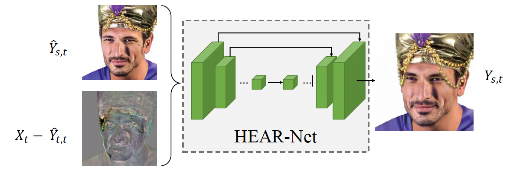

## HEAR-Net Pytorch Implementation

This repository contains an unofficial implementation of **HEAR-Net**(Heuristic Error Acknowledging Refinement Network) introduced in the following paper:

Li, Lingzhi, et al. "[Faceshifter: Towards high fidelity and occlusion aware face swapping](https://arxiv.org/abs/1912.13457)." arXiv preprint arXiv:1912.13457 (2019).



## Environment

Dockerfile will be updated.


## Usage

### Train

Please run the following command after placing all the needed datasets:

```python3 train.py --source_images {SOURCE_PATH} --target_images {TARGET_PATH} --swapped_images {SWAPPED_PATH} heuristic_errors {ERROR_PATH} ```


### Inference

Please run the following command after placing all the needed datasets:

```python3 train.py --swapped_images {SWAPPED_PATH} heuristic_errors {ERROR_PATH} ```